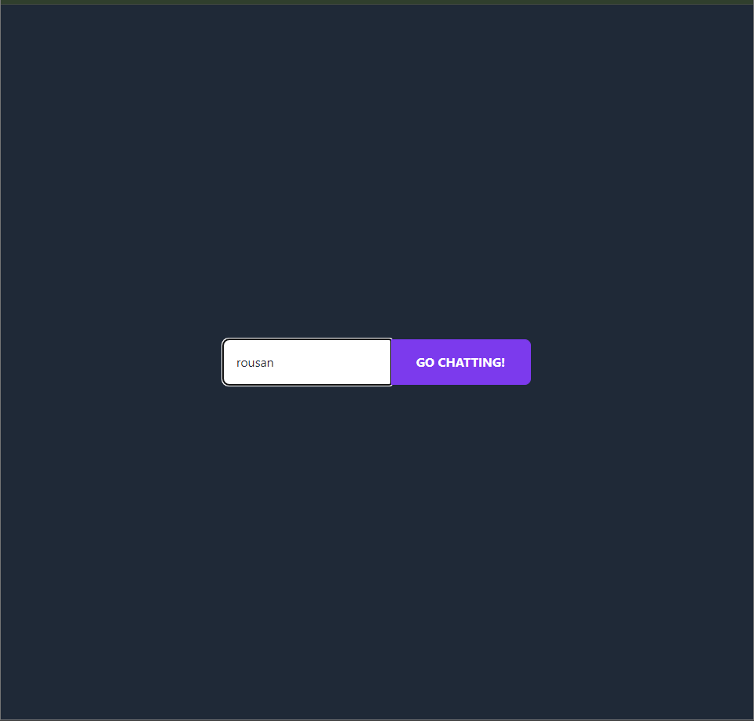
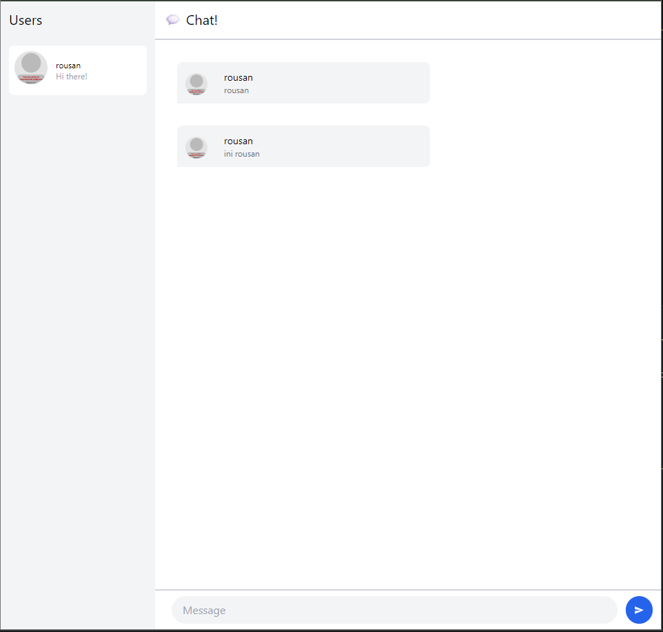
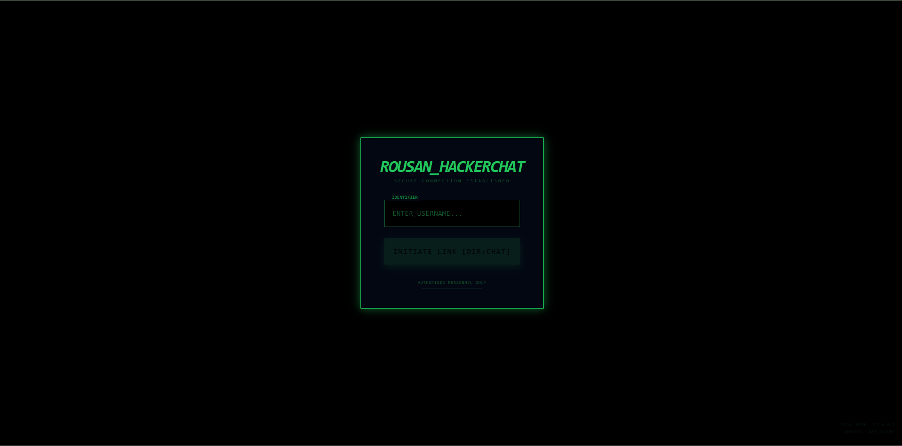
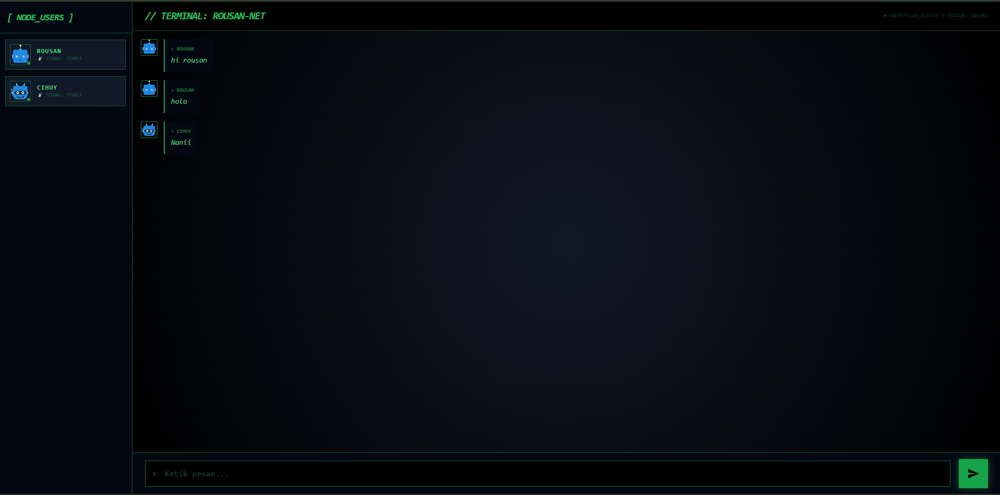

# Tutorial 10: WebChat using Yew

## Experiment 3.1: Original Code
Berhasil menjalankan client YewChat dan SimpleWebsocketServer. Aplikasi dapat mengirim pesan antar tab menggunakan WebSocket.



Dalam tahap awal ini, saya melakukan implementasi sistem WebChat menggunakan bahasa pemrograman **Rust** dengan *framework* **Yew** sebagai *frontend* (*webclient*). Arsitektur ini memungkinkan pembuatan aplikasi web berperforma tinggi menggunakan **WebAssembly (WASM)**. 

Komunikasi data dilakukan secara *asynchronous* melalui protokol **WebSocket**, sehingga setiap pengguna dapat mengirim dan menerima pesan secara *real-time* tanpa perlu melakukan *refresh* pada browser. Implementasi ini melibatkan dua komponen utama:
1. **YewChat**: Bertugas sebagai *client-side interface* yang menangani *routing* dan interaksi pengguna.
2. **SimpleWebsocketServer**: Folder server berbasis Node.js yang bertugas sebagai *relay* pesan antar *client*.


**Menjalankan WebSocket Server:**
Masuk ke direktori server dan jalankan perintah berikut untuk mengaktifkan *backend*:
```bash
npm install
npm start


## Experiment 3.2: Be Creative!




Pada eksperimen ini, saya memberikan sentuhan kreativitas pada tampilan webclient YewChat dengan mengusung tema **"Nusantara Cyber-Terminal"**. Saya merombak total skema warna original menjadi dominan hitam dengan aksen hijau neon (`#22c55e`) untuk menciptakan suasana terminal keamanan tingkat tinggi yang futuristik dan ikonik.

Selain itu, saya memodifikasi seluruh teks dalam aplikasi menjadi bahasa teknis terminal yang lebih ekspresif. Judul aplikasi diubah menjadi `// TERMINAL: ROUSAN-NET` dan tombol login diubah menjadi `INITIATE LINK [DIR:CHAT]`. Saya juga mengganti sistem avatar menggunakan API Dicebear **Bottts** sehingga setiap pengguna direpresentasikan oleh ikon robot unik yang selaras dengan tema teknologi Rust.

Perubahan ini juga mencakup penambahan elemen dekoratif seperti indikator status `● encryption_active` dan `signal: stable` yang memiliki animasi *pulse*. Melalui eksperimen ini, saya memahami bahwa kreativitas dalam pengembangan perangkat lunak tidak hanya soal estetika, tetapi juga tentang bagaimana membangun *branding* dan atmosfer aplikasi melalui visual, teks, dan interaksi yang konsisten tanpa merubah mekanisme utama WebSocket di belakangnya.
